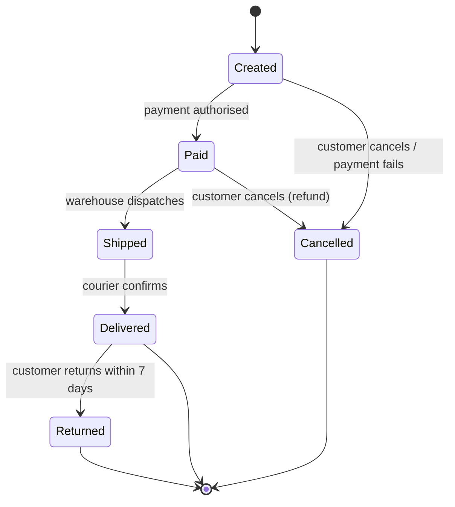

# Chapter 7 — Test Case Design

> **Software Testing Foundation · Module: Test Design & Strategy**
> **Chapter 7 of 10** · ⏱️ **Time: 45 minutes** (25 min reading + 20 min practice). *The largest chapter in the module.*
> **Previous:** [← Chapter 6 — Test Scenarios](06-test-scenarios.md) · **Next:** [Chapter 8 — Defect Life Cycle →](08-defect-life-cycle.md)

---

## Learning Objectives

By the end of this chapter you will be able to:

1. Define a test case and describe each field of a standard test case.
2. Write clear, executable **positive** and **negative** test cases with preconditions, test data, steps, and expected results.
3. Record **actual results** and **pass/fail** status correctly.
4. Build **traceability** from requirements to test cases.
5. Apply seven test design techniques: **Equivalence Partitioning, Boundary Value Analysis, Decision Tables, State Transition, Pairwise, Error Guessing, and Exploratory Testing**.
6. Explain why **good test design matters more than writing more test cases**.

---

## Where This Chapter Fits

This chapter brings everything together:

```text
Ch.3/4 Use case / User story  ──►  Ch.5 Acceptance criteria  ──►  Ch.6 Test scenarios
                                                                         │
                                                                         ▼
                         Ch.2 Strategy (priority, depth)  ──►  Ch.7 TEST CASES  ──►  Ch.8 Defects
                                                                         │
                                                                         ▼
                                                              Ch.9 Estimation (count & effort)
```

A scenario says **what** to test. A test case says **exactly how**, precisely enough that **anyone** on the team could run it and get the same result.

---

# Part A — Writing Test Cases

## 1. What Is a Test Case?

A **test case** is a documented set of **preconditions, inputs (test data), execution steps, and expected results**, written to verify one specific condition of the software.

A good test case is:

| Quality | Meaning |
|---|---|
| **Clear** | A new team member can run it without asking questions |
| **Atomic** | Verifies *one* condition (one reason to fail) |
| **Repeatable** | Same input → same result every time |
| **Traceable** | Linked to a requirement / AC / scenario |
| **Independent** | Doesn't rely on another test case having run first (where possible) |
| **Has a verifiable expected result** | Pass/fail is objective, not opinion |

---

## 2. Test Case Structure

| Field | Example |
|---|---|
| Test Case ID | TC_LOGIN_001 |
| Scenario | Valid login |
| Preconditions | Registered user exists |
| Test Data | Valid username/password |
| Steps | Enter credentials → Click Login |
| Expected Result | User reaches dashboard |
| Actual Result | — |
| Status | Not Executed |

This compact form is a good start. In real projects, test cases are more precise. Here is the same test case written to industry standard:

| Field | Value |
|---|---|
| **Test Case ID** | TC_LOGIN_001 |
| **Title** | Verify successful login with valid email and password |
| **Requirement / AC** | US-101 / AC1 |
| **Scenario ID** | TS_LOGIN_01 – Valid login |
| **Priority** | P1 (High) |
| **Type** | Functional, Positive |
| **Preconditions** | 1. User `asha@example.com` is registered and active. 2. User is logged out. 3. Browser: Chrome (latest). |
| **Test Data** | Email: `asha@example.com` · Password: `Shop@1234` |
| **Steps** | 1. Open `https://qa.shopeasy.com/login`  2. Enter email `asha@example.com`  3. Enter password `Shop@1234`  4. Click **Login** |
| **Expected Result** | 1. User is redirected to `/dashboard`. 2. Header shows "Hi, Asha". 3. No error message is displayed. |
| **Actual Result** | *(filled during execution)* |
| **Status** | Not Executed |
| **Executed By / Date** | *(filled during execution)* |
| **Defect ID** | *(if failed)* |

### 2.1 Field-by-Field Guidance

#### Test Case ID
A unique, meaningful identifier. Convention: `TC_<MODULE>_<NNN>`, for example `TC_LOGIN_001`, `TC_CHK_014`. We use this convention for the rest of the course, including the capstone.

#### Preconditions
What must be **true before step 1**: user accounts, data, configuration, environment, login state.
- ✅ "User has 2 items in cart; card `4111…1111` is a valid test card."
- ❌ Hiding setup actions inside steps, or leaving preconditions out.

#### Test Data
The **exact values** used. Vague data produces unrepeatable tests.
- ✅ `Amount: 5001` (balance is `5000`)
- ❌ "Enter a large amount"

Good test data practice:
- Prepare it **before** execution (accounts, products, cards, coupons).
- Use **dedicated test accounts**, never real customer data.
- Note **data that gets consumed** (a single-use coupon can only be tested once per setup).

#### Steps
- Numbered, one action per step, starting with a verb: *Open, Enter, Click, Select, Verify*.
- Specific enough to follow without guessing, but **not** so detailed that every UI tweak breaks them.

#### Expected Result
The **most important field.** It must come from the requirement/AC, **not** from what the system currently does.
- ✅ "Error 'Insufficient balance' is shown; account balance remains ₹5,000; no transaction is created."
- ❌ "System should work properly." / "Error shown."

> 💡 Check **all observable effects**: the UI message, the data change (balance, database), side effects (email, SMS), and what should **not** happen (no order created, no charge).

#### Actual Result
What **really** happened during execution. Record facts, not opinions.
- ✅ "Error 'Something went wrong' shown; balance reduced to ₹-1; transaction TXN8812 created."
- ❌ "Didn't work."

#### Status (Pass / Fail and others)

| Status | Meaning |
|---|---|
| **Not Executed** | Not yet run |
| **Pass** | Actual result matches expected result exactly |
| **Fail** | Actual result differs from expected; **log a defect** (Chapter 8) and link its ID |
| **Blocked** | Cannot be executed due to an external issue (environment down, dependent defect) |
| **Skipped / N/A** | Deliberately not run in this cycle (out of scope) |

> ⚠️ **Partially passed** is not a status. If any expected result is not met, the test case **fails**.

---

## 3. Traceability

**Traceability** is the ability to link every test artefact back to its **requirement** and forward to its **results and defects**.

```text
Requirement ─► Acceptance Criterion ─► Test Scenario ─► Test Case ─► Execution Result ─► Defect
  US-101             AC1                  TS_LOGIN_01     TC_LOGIN_001      Fail               BUG-245
```

### Requirements Traceability Matrix (RTM)

| Req / AC | Scenario | Test Cases | Last Result | Defects |
|---|---|---|---|---|
| US-101 AC1: valid login | TS_LOGIN_01 | TC_LOGIN_001 | ✅ Pass | — |
| US-101 AC2: invalid password shows error | TS_LOGIN_02 | TC_LOGIN_002, 003 | ❌ Fail | BUG-245 |
| US-101 AC3: lock after 5 failures | TS_LOGIN_05 | TC_LOGIN_007, 008 | ⏸ Blocked | — |
| US-101 AC4: password reset | — | — | ⚠️ **No coverage** | — |

**Why it matters:**
- **Coverage:** shows untested requirements (AC4 above).
- **Impact analysis:** when AC2 changes, you know exactly which tests to update.
- **Release decisions:** "Is every P1 requirement passing?"
- **Audits:** regulated industries (banking, healthcare) require it.

---

## 4. Positive and Negative Test Cases

| | **Positive** | **Negative** |
|---|---|---|
| Input | Valid | Invalid, unexpected, missing |
| Goal | System does what it should | System **handles errors gracefully** and does **not** do what it shouldn't |
| Example | Login with valid credentials → dashboard | Login with wrong password → error, no session |

### Example Set: Login

| ID | Title | Test Data | Expected Result | Type |
|---|---|---|---|---|
| TC_LOGIN_001 | Valid login | `asha@example.com` / `Shop@1234` | Dashboard displayed | Positive |
| TC_LOGIN_002 | Wrong password | `asha@example.com` / `Wrong@123` | "Invalid email or password"; stays on login page | Negative |
| TC_LOGIN_003 | Unregistered email | `nobody@example.com` / `Shop@1234` | Same generic message as 002 | Negative |
| TC_LOGIN_004 | Empty email & password | `""` / `""` | "Email and password are required"; Login not submitted | Negative |
| TC_LOGIN_005 | Invalid email format | `asha@` / `Shop@1234` | "Enter a valid email address" | Negative |
| TC_LOGIN_006 | Email with leading/trailing spaces | `"  asha@example.com "` / `Shop@1234` | Spaces trimmed; login succeeds | Positive (edge) |
| TC_LOGIN_007 | 5th consecutive wrong password | 5 × wrong password | Account locked; "Account locked for 15 minutes" | Negative / Business rule |
| TC_LOGIN_008 | Correct password while locked | correct password after lock | Still locked; login refused | Negative |
| TC_LOGIN_009 | SQL injection in email | `' OR '1'='1` / `x` | Rejected safely; no login; no DB error shown | Negative / Security |
| TC_LOGIN_010 | Back button after logout | — | Dashboard not accessible; redirected to login | Negative / Security |

> In mature test suites, **negative test cases often outnumber positive ones**. That is where the defects live.

---

# Part B — Test Design Techniques

## 5. Why Techniques? Good Design Beats More Test Cases

Consider this requirement:

> User must be between 18 and 60 years old.

You *could* test every age from 0 to 120: 121 test cases. That's slow and adds almost nothing. Or you could test 6 well-chosen values and catch practically every realistic defect. **Test design techniques tell you which few values matter most.** They give you **maximum defect-finding power with minimum test cases**.

The techniques covered:

| # | Technique | Best for |
|---|---|---|
| 1 | Equivalence Partitioning | Input ranges and categories |
| 2 | Boundary Value Analysis | Limits and edges of ranges |
| 3 | Decision Table Testing | Combinations of conditions/business rules |
| 4 | State Transition Testing | Objects that move through states |
| 5 | Pairwise Testing | Many parameters/configurations |
| 6 | Error Guessing | Known weak spots, based on experience |
| 7 | Exploratory Testing | Learning and finding the unexpected |

---

## 6. Equivalence Partitioning (EP)

**Idea:** divide inputs into **partitions (classes)** where the system should behave **the same way** for every value. Test **one representative value per partition**. If one value in a class works (or fails), the others probably will too.

### Example: Age Field

> User must be between 18 and 60 years old.

**Equivalence partitions**

- `<18` → Invalid
- `18–60` → Valid
- `>60` → Invalid

| Partition | Representative value | Expected |
|---|---|---|
| Below 18 (invalid) | 10 | Rejected: "Age must be 18–60" |
| 18–60 (valid) | 35 | Accepted |
| Above 60 (invalid) | 75 | Rejected |

**Don't forget the non-obvious partitions:**

| Partition | Value | Expected |
|---|---|---|
| Non-numeric | `abc` | Rejected |
| Empty | `""` | "Age is required" |
| Decimal | `25.5` | Rejected (or per requirement; **ask!**) |
| Negative | `-5` | Rejected |
| Special characters | `#$%` | Rejected |

**Result:** 3 core test cases (plus a few format checks) instead of 121.

---

## 7. Boundary Value Analysis (BVA)

**Idea:** defects cluster **at the edges** of partitions. Developers write `<` instead of `<=`, or `>` instead of `>=`. So test **at, just below, and just above each boundary**.

### Example: Age Field (18–60)

**Boundary values**

- 17
- 18
- 19
- 59
- 60
- 61

```text
        INVALID          │              VALID                 │      INVALID
  ... 15  16  [17]       │ [18]  [19]  ...  ...  [59]  [60]   │  [61]  62 ...
                     lower boundary                     upper boundary
```

| Value | Position | Expected |
|---|---|---|
| 17 | Just below lower boundary | ❌ Rejected |
| 18 | On lower boundary | ✅ Accepted |
| 19 | Just above lower boundary | ✅ Accepted |
| 59 | Just below upper boundary | ✅ Accepted |
| 60 | On upper boundary | ✅ Accepted |
| 61 | Just above upper boundary | ❌ Rejected |

> This is **3-value BVA** (below, on, above). Some teams use **2-value BVA** (17, 18, 60, 61), which catches most of the same bugs with fewer tests.

### The Bug BVA Catches

```text
Developer wrote:   if (age > 18 && age <= 60)   // wrong, should be >= 18
EP test (age 35):  ✅ passes, bug NOT found
BVA test (age 18): ❌ fails, bug FOUND
```

**EP and BVA work together:** EP picks the partitions; BVA tests their edges. Together they replace 121 tests with about **6–9 high-value tests**. This is why **good test design matters more than simply writing more test cases.**

### BVA Applies to More Than Numbers
- **String length:** password 8–20 chars → test 7, 8, 9, 19, 20, 21 characters.
- **Dates:** coupon valid until 31-Dec → test 30-Dec, 31-Dec, 1-Jan.
- **Time:** link valid 30 minutes → test 29:59, 30:00, 30:01.
- **Quantity:** max 10 per product → test 9, 10, 11 (and 0, 1 on the lower side).
- **Money:** free shipping ≥ ₹999 → test ₹998.99, ₹999.00, ₹999.01.

---

## 8. Decision Table Testing

**Idea:** when the output depends on **combinations of conditions** (business rules), list every combination in a table so that **none is missed**.

### Example: ShopEasy Shipping and Discount Rules

Business rules:
- Shipping is **free** if the customer is a **Premium member** OR the **order total ≥ ₹999**; otherwise shipping costs **₹50**.
- A **valid coupon** gives **10% off**.

With 3 conditions (Y/N each) → 2³ = **8 rules**.

| Conditions / Actions | R1 | R2 | R3 | R4 | R5 | R6 | R7 | R8 |
|---|---|---|---|---|---|---|---|---|
| **C1:** Premium member? | Y | Y | Y | Y | N | N | N | N |
| **C2:** Order ≥ ₹999? | Y | Y | N | N | Y | Y | N | N |
| **C3:** Valid coupon? | Y | N | Y | N | Y | N | Y | N |
| **A1:** Free shipping | ✔ | ✔ | ✔ | ✔ | ✔ | ✔ | — | — |
| **A2:** ₹50 shipping | — | — | — | — | — | — | ✔ | ✔ |
| **A3:** 10% discount | ✔ | — | ✔ | — | ✔ | — | ✔ | — |

**Each rule (column) = one test case.** For example:
- **R7:** Non-premium, order ₹500, valid coupon → **₹50 shipping + 10% discount**.
- **R8:** Non-premium, order ₹500, no coupon → **₹50 shipping, no discount**.

> 💡 Building the table often reveals **missing rules**. *Is the ₹999 threshold checked before or after the 10% discount?* (An order of ₹1,050 becomes ₹945 after the discount. Free shipping or not?) That's a question for the product owner, and a likely defect if nobody asked.

**Collapsing:** if some conditions don't matter for some rules, you can merge columns. Here R1–R4 all give free shipping regardless of C2. But as a beginner, write the full table first.

---

## 9. State Transition Testing

**Idea:** some objects move through **states**, and **events** cause **transitions**. Test that **valid transitions work** and **invalid transitions are blocked**.

### Example: ShopEasy Order Status



*(Text version, in case the diagram does not render:)*

```text
Created ──payment authorised──► Paid ──dispatch──► Shipped ──delivered──► Delivered ──return──► Returned
   │                              │
   └──cancel / payment fails──►  Cancelled ◄──cancel (refund)──┘
```

### State Transition Table

| Current State | Event | Next State | Valid? |
|---|---|---|---|
| Created | Payment authorised | Paid | ✅ |
| Created | Payment fails / cancel | Cancelled | ✅ |
| Paid | Dispatch | Shipped | ✅ |
| Paid | Cancel | Cancelled (refund issued) | ✅ |
| Shipped | Courier confirms | Delivered | ✅ |
| Delivered | Return within 7 days | Returned | ✅ |
| **Shipped** | **Cancel** | — | ❌ Must be blocked |
| **Cancelled** | **Dispatch** | — | ❌ Must be blocked |
| **Delivered** | **Return on day 8** | — | ❌ Must be blocked (boundary!) |
| **Created** | **Dispatch** (unpaid) | — | ❌ Must be blocked |

**Test cases come from:**
1. Each **valid transition** (at least once).
2. Each important **invalid transition**. These often expose serious bugs, like *shipping an unpaid order*.
3. Full **paths**, e.g. Created → Paid → Shipped → Delivered → Returned.

Other common state machines: **user account** (Active → Locked → Active), **defect lifecycle** (Chapter 8), **subscription** (Trial → Active → Expired), **ATM session** (Chapter 3).

---

## 10. Pairwise Testing

**Problem:** many parameters with several values each create a **combinatorial explosion**.

**Idea:** most defects are caused by a single parameter or by the **interaction of two parameters**. So instead of testing *all* combinations, test a set in which **every pair of values appears at least once**.

### Example: ShopEasy Checkout Configuration

| Parameter | Values |
|---|---|
| Browser | Chrome, Firefox, Safari |
| Device | Desktop, Mobile |
| User type | Guest, Registered |

All combinations: 3 × 2 × 2 = **12**. A pairwise set needs only **6**:

| # | Browser | Device | User type |
|---|---|---|---|
| 1 | Chrome | Desktop | Guest |
| 2 | Chrome | Mobile | Registered |
| 3 | Firefox | Desktop | Registered |
| 4 | Firefox | Mobile | Guest |
| 5 | Safari | Desktop | Guest |
| 6 | Safari | Mobile | Registered |

**Check:** every Browser–Device pair appears (6/6), every Browser–User pair appears (6/6), and every Device–User pair appears (4/4). ✅

The savings grow fast. With **4 parameters × 3 values each**, all combinations = 81, and a pairwise set can be as small as **9**. Tools such as **PICT** (Microsoft), **AllPairs**, or online pairwise generators build these sets for you.

> ⚠️ Pairwise is a **risk-reduction shortcut**, not a guarantee. For critical combinations (e.g., *Safari + Mobile + Saved card*), add explicit tests.

---

## 11. Error Guessing

**Idea:** use **experience and intuition** to predict where developers commonly make mistakes, then target those spots.

### A Tester's Error-Guessing Checklist

| Area | Things to try |
|---|---|
| **Inputs** | Empty, spaces only, leading/trailing spaces, very long strings (5,000 chars), emoji 😀, Unicode (José, 北京), HTML `<b>`, script `<script>alert(1)</script>`, SQL `' OR 1=1--` |
| **Numbers** | 0, negative, decimals, very large (999999999), leading zeros (007), scientific notation (1e5) |
| **Dates** | 29-Feb, 31-Apr, past/future dates, time zones, daylight-saving changes |
| **Actions** | Double-click Submit, browser Back/Refresh during processing, open in two tabs, copy-paste |
| **Session** | Session timeout mid-flow, logout in another tab, expired token |
| **Network** | Slow 3G, disconnect mid-request, retry after timeout |
| **Files** | Empty file, huge file, wrong extension, renamed `.exe` as `.jpg` |
| **Data state** | Item deleted by admin while in a user's cart; price changed during checkout |

**Example test cases from error guessing (checkout):**
- Double-click **Place Order**: only **one** order and **one** charge must be created.
- Press browser **Back** after payment success: must not show the payment form again or re-charge.
- Two tabs check out the **last item in stock** at the same time: only one should succeed.

Error guessing is **unstructured**, so use it **in addition to** formal techniques, never instead of them.

---

## 12. Exploratory Testing (as a Design Technique)

In exploratory testing, **test design and execution happen at the same time**. You design the next test based on what you just learned.

### How to Run a Session
1. **Charter:** *"Explore the checkout payment step using different card types and network conditions to discover error-handling and duplicate-charge issues."*
2. **Time-box:** 60 minutes.
3. **Explore** using heuristics, for example:
   - **CRUD:** create, read, update, delete each thing you see.
   - **Goldilocks:** too small, too big, just right.
   - **Interrupt:** stop the flow midway (refresh, back, close tab).
   - **Follow the data:** where does what I entered end up (email, invoice, DB, admin panel)?
4. **Take notes:** what you tried, what you found, questions, ideas for new scripted tests.
5. **Debrief:** share bugs, risks, and coverage with the team.

### Scripted vs. Exploratory

| | **Scripted test cases** | **Exploratory testing** |
|---|---|---|
| Designed | Before execution | During execution |
| Strength | Repeatable, traceable, good for regression and audits | Finds unexpected bugs, adapts quickly, uses tester skill |
| Weakness | Only finds what you anticipated | Harder to repeat or measure |
| Best together? | ✅ Yes. Script the known; explore the unknown. | |

> 💡 A good exploratory session **produces new scripted test cases**: any important bug you find should become a regression test.

---

## 13. Choosing the Right Technique

| If the requirement has… | Use |
|---|---|
| Input ranges (age, amount, length) | **EP + BVA** |
| Multiple conditions → different outcomes | **Decision table** |
| Statuses / workflows | **State transition** |
| Many configurations (browser, device, OS, payment) | **Pairwise** |
| Known risky patterns, past bugs | **Error guessing** |
| New / unclear / complex features | **Exploratory** |

Most real features need **several techniques together**. A checkout uses EP/BVA (quantities, amounts), decision tables (shipping/discount rules), state transitions (order status), pairwise (browsers × devices × payment methods), and error guessing (double-click, back button).

---

## ⚠️ Common Beginner Mistakes

1. **Vague expected results:** "should work", "error shown". Specify the exact message and data effects.
2. **Expected result copied from current behaviour** instead of from the requirement. You end up "verifying" bugs.
3. **Multiple conditions in one test case.** When it fails, you don't know which part broke.
4. **No test data**, or real customer data used.
5. **Testing only mid-range values** and skipping the boundaries.
6. **Marking "Pass" when something was slightly off.** If it doesn't match, it's a Fail (or ask).
7. **Writing more tests instead of better tests.** Ten random tests are worth less than six well-designed boundary tests.

---

## 📝 Practice Exercises (≈ 20 minutes)

### Exercise 1: Write Test Cases (≈ 7 min)
Using the fund transfer scenarios from Chapter 6, write **full test cases** (ID, title, preconditions, test data, steps, expected result) for:
- (a) Transfer valid amount
- (b) Transfer amount exceeding balance

<details>
<summary>✅ Model answer</summary>

| Field | TC_TRF_001 | TC_TRF_002 |
|---|---|---|
| **Title** | Verify successful transfer of a valid amount between own accounts | Verify transfer is rejected when amount exceeds available balance |
| **Req / Scenario** | US-210 AC1 / TS_TRF_01 | US-210 AC3 / TS_TRF_02 |
| **Priority** | P1 | P1 |
| **Preconditions** | User `ravi01` logged in; Savings A/c `…1234` balance ₹10,000; Current A/c `…5678` balance ₹2,000; daily limit ₹50,000 unused | User `ravi01` logged in; Savings A/c `…1234` balance ₹5,000 |
| **Test Data** | From `…1234`, To `…5678`, Amount `2500`, Remark `Rent` | From `…1234`, To `…5678`, Amount `5001` |
| **Steps** | 1. Go to Transfers → Own Accounts  2. Select From `…1234`  3. Select To `…5678`  4. Enter Amount `2500`, Remark `Rent`  5. Click **Transfer**  6. Enter valid OTP and confirm | 1. Go to Transfers → Own Accounts  2. Select From `…1234`  3. Select To `…5678`  4. Enter Amount `5001`  5. Click **Transfer** |
| **Expected Result** | 1. Success message with transaction reference. 2. `…1234` balance = ₹7,500. 3. `…5678` balance = ₹4,500. 4. Transaction appears in both statements with remark "Rent". 5. SMS/email confirmation sent. | 1. Error "Insufficient balance" displayed. 2. OTP is **not** requested. 3. `…1234` balance remains ₹5,000. 4. No transaction created in either statement. |
| **Actual Result / Status** | — / Not Executed | — / Not Executed |

</details>

### Exercise 2: EP and BVA (≈ 5 min)
**Requirement:** *Cart quantity per product must be between 1 and 10.*
List the equivalence partitions and the BVA values with expected results.

<details>
<summary>✅ Model answer</summary>

**Partitions:** `< 1` invalid · `1–10` valid · `> 10` invalid · plus non-numeric / empty / decimal invalid.

| Value | Technique | Expected |
|---|---|---|
| 0 | BVA (below lower) | Rejected |
| 1 | BVA (lower boundary) | Accepted |
| 2 | BVA (above lower) | Accepted |
| 5 | EP (valid representative) | Accepted |
| 9 | BVA (below upper) | Accepted |
| 10 | BVA (upper boundary) | Accepted |
| 11 | BVA (above upper) | Rejected: "Maximum 10 per product" |
| -3 | EP (negative) | Rejected |
| `abc`, `""`, `2.5` | EP (format) | Rejected |

</details>

### Exercise 3: Decision Table (≈ 8 min)
**Login rules:**
- Login succeeds only if the **email is registered** AND the **password is correct** AND the **account is not locked**.
- If the account is locked, show "Account locked" (regardless of password).
- Otherwise, if email or password is wrong, show "Invalid email or password".

Build the decision table and identify the test cases.

<details>
<summary>✅ Model answer</summary>

| | R1 | R2 | R3 | R4 | R5 |
|---|---|---|---|---|---|
| **C1:** Email registered? | Y | Y | Y | Y | N |
| **C2:** Password correct? | Y | N | Y | N | – |
| **C3:** Account locked? | N | N | Y | Y | – |
| **A1:** Login success | ✔ | | | | |
| **A2:** "Invalid email or password" | | ✔ | | | ✔ |
| **A3:** "Account locked" | | | ✔ | ✔ | |

*R5 is collapsed: if the email is not registered, password and lock status are irrelevant ("–"). The full table would have 8 rules; 4 of them (C1 = N) produce the same outcome.*

Test cases: **5**, one per rule. Note **R3**: a correct password on a locked account must still be refused. This is a classic bug.

</details>

---

## 🧠 Quick Check

1. Which field of a test case must be derived from the requirement rather than from current system behaviour?
2. For a password length of 8–20 characters, what are the 3-value BVA lengths?
3. A feature has 3 conditions, each Y/N. How many rules are in the full decision table?
4. Which technique would you use for a subscription that moves through Trial → Active → Expired?
5. What is the main benefit of pairwise testing?
6. A test case has 3 expected results; 2 match and 1 doesn't. What's the status?

<details>
<summary>Answers</summary>

1. **Expected Result.**
2. **7, 8, 9, 19, 20, 21.**
3. **2³ = 8.**
4. **State transition testing.**
5. It drastically **reduces the number of combinations** while still covering every pair of parameter values.
6. **Fail.** Log a defect.

</details>

---

## 🔑 Key Takeaways

- A test case = **ID + preconditions + test data + steps + expected result + actual result + status**, traceable to a requirement.
- **Expected results** must be specific and come from the requirement, including what should **not** happen.
- **Traceability (RTM)** proves coverage and supports impact analysis.
- **EP** picks representative values; **BVA** tests the edges where bugs cluster.
- **Decision tables** handle rule combinations; **state transitions** handle workflows; **pairwise** tames configuration explosion.
- **Error guessing** and **exploratory testing** add human insight that formal techniques miss.
- **Good test design is more important than simply writing more test cases.**

---

**Next:** [Chapter 8 — Defect Life Cycle →](08-defect-life-cycle.md). When a test case fails, you've found a defect. Next: how to report it well and follow it from discovery to closure.
