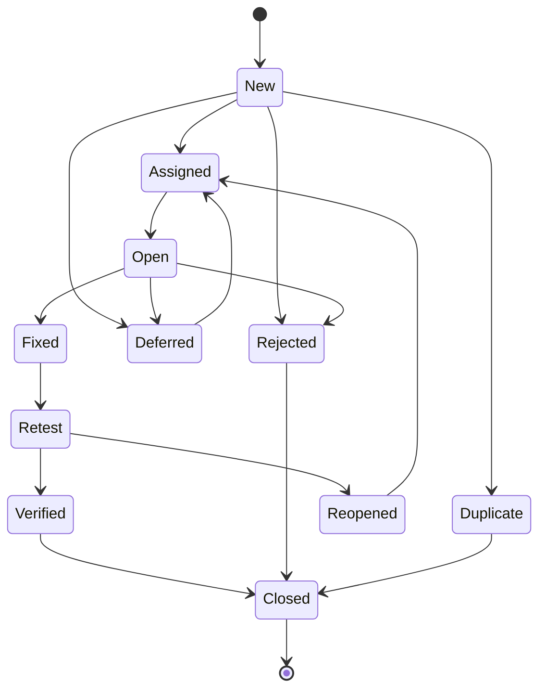

# Chapter 8 — Defect Life Cycle

> **Software Testing Foundation · Module: Test Design & Strategy**
> **Chapter 8 of 10** · ⏱️ **Time: 25 minutes** (14 min reading + 11 min practice)
> **Previous:** [← Chapter 7 — Test Case Design](07-test-case-design.md) · **Next:** [Chapter 9 — Test Estimation →](09-test-estimation.md)

---

## Learning Objectives

By the end of this chapter you will be able to:

1. Define a defect and distinguish **error**, **defect**, and **failure**.
2. Write a clear, reproducible **defect report**.
3. Assign **severity** and **priority** correctly, and explain why they differ.
4. Trace a defect through its **life cycle states**, including alternate paths.
5. Explain **defect ownership**, **retesting**, **regression testing**, and **closure**.

---

## Where This Chapter Fits

In Chapter 7 you executed test cases. When the **actual result ≠ expected result**, the test **fails**, and you have probably found a **defect**. How you report it decides whether it gets fixed quickly, argued about, or ignored. This chapter covers what happens next.

---

## 1. What Is a Defect?

A **defect** (also called a **bug**) is a flaw in a work product (code, requirement, design) that causes, or can cause, the system to **deviate from its expected behaviour or requirements**.

### Error vs. Defect vs. Failure

```text
   HUMAN                     WORK PRODUCT                 RUNNING SYSTEM
  ┌───────┐   causes   ┌──────────────────┐   may cause  ┌───────────────┐
  │ ERROR │ ─────────► │ DEFECT (Bug/Fault)│ ───────────► │    FAILURE    │
  └───────┘            └──────────────────┘   when run    └───────────────┘
  A mistake made        A flaw in code,                  Observable wrong
  by a person           requirement or design            behaviour
```

| Term | What it is | Example |
|---|---|---|
| **Error (mistake)** | A **human action** that produces an incorrect result | Developer misreads "18 or older" as "older than 18" |
| **Defect (bug, fault)** | The **flaw** in the work product resulting from the error | Code says `if (age > 18)` instead of `if (age >= 18)` |
| **Failure** | The **observable deviation** when the defective code runs | An 18-year-old user is rejected at signup |

**Key points:**
- Not every defect causes a failure. If no 18-year-old ever signs up, the defect stays hidden.
- Failures can also come from the **environment** (hardware fault, misconfiguration), not just defects.
- Testers usually **observe failures** and **report defects**. Developers then **find and fix** the defect.

---

## 2. Defect Reporting

A defect report must let a developer **reproduce the problem without talking to you**.

### Anatomy of a Good Defect Report

| Field | Example |
|---|---|
| **Defect ID** | BUG-250 (auto-generated by Jira/Azure DevOps) |
| **Title / Summary** | Checkout: order is created even when payment is declined |
| **Module / Component** | Checkout → Payment |
| **Environment** | QA env, build 3.2.0-rc4, Chrome 129, Windows 11 |
| **Preconditions** | User `asha@example.com` logged in; 1 item in cart (₹1,200) |
| **Test Data** | Card `4000 0000 0000 0002` (gateway test card that always declines) |
| **Steps to Reproduce** | 1. Go to Cart → Checkout  2. Select saved address  3. Enter card `4000…0002`, exp `12/28`, CVV `123`  4. Click **Place Order** |
| **Expected Result** | Error "Payment declined"; **no order created**; cart still contains the item (per US-301 AC7) |
| **Actual Result** | Error "Payment declined" shown, **but** order `ORD-10234` is created with status "Pending" and appears in My Orders; cart is emptied |
| **Severity** | Critical |
| **Priority** | P1 |
| **Reproducibility** | Always (5/5 attempts) |
| **Attachments** | Screenshot of My Orders, screen recording, network log (HAR) |
| **Linked Test Case / Requirement** | TC_CHK_005 / US-301 AC7 |
| **Reported By / Date** | QA – Priya, 06-Oct-2026 |
| **Assigned To** | (set by triage) |

### Tips for Great Defect Reports

| ✅ Do | ❌ Don't |
|---|---|
| **Title = Where + What + When**: "Checkout: order created when payment declined" | "Checkout broken", "Bug!!!" |
| One defect per report | Combine three issues into one ticket |
| Exact steps and test data | "Try paying with a bad card" |
| State the **expected result** with its source (AC/requirement) | Assume the developer knows what's expected |
| Attach evidence (screenshot, video, logs) | Rely on description only |
| Mention reproducibility (Always / Intermittent 2/10) | Omit; developer can't reproduce and rejects it |
| Stay factual and neutral | "The developer obviously didn't test this" |
| Search for duplicates first | Raise the same bug three times |

---

## 3. Severity vs. Priority

> **Severity:** How badly does the defect affect the system?

> **Priority:** How urgently should we fix it?

| | **Severity** | **Priority** |
|---|---|---|
| **About** | **Impact** on functionality / system | **Urgency** / business importance of fixing |
| **Usually set by** | Tester (technical judgement) | Product owner / project manager (business judgement) |
| **Changes over time?** | Rarely; the impact is what it is | Often; depends on release dates, customers, business events |

### Severity Levels (typical)

| Level | Meaning | Example |
|---|---|---|
| **Critical / Blocker** | System crash, data loss, security breach, core flow unusable, no workaround | Payment charges the card but no order is created |
| **High / Major** | Major feature broken; workaround is hard | Search returns no results for any query with a space |
| **Medium / Moderate** | Feature partly broken; reasonable workaround exists | Sorting by price ignores sale prices |
| **Low / Minor** | Cosmetic or minor inconvenience | Misaligned icon; typo in footer |

### Priority Levels (typical)
**P1 / Urgent:** fix immediately (hotfix / this build). **P2 / High:** fix in this release. **P3 / Medium:** fix when possible. **P4 / Low:** backlog.

### The Four Combinations

| | **High Priority** | **Low Priority** |
|---|---|---|
| **High Severity** | Checkout crashes for all users. *Fix now.* | App crashes when exporting a report in a legacy browser used by 0.1% of users. *Serious, but rare: schedule it.* |
| **Low Severity** | **A typo on the homepage** may have **low severity but high priority** if it is visible to millions of customers (e.g., the company name or the price "₹9,999" shown as "₹99.99"). | Spelling error on an internal admin help page. *Backlog.* |

> 💡 **Remember:** Severity is about the **system**. Priority is about the **business**.

---

## 4. Defect States: The Life Cycle

### Typical Lifecycle

**New → Assigned → Open → Fixed → Retest → Verified → Closed**

With possible alternate paths:

**Rejected** · **Duplicate** · **Deferred** · **Reopened**



*(Text version, in case the diagram does not render:)*

```text
                ┌──► Rejected ──┐
                ├──► Duplicate ─┤
                ├──► Deferred ──┼─(later)─► Assigned
                │               ▼
 New ──► Assigned ──► Open ──► Fixed ──► Retest ──► Verified ──► Closed
              ▲                              │
              └────────── Reopened ◄─────────┘ (fix didn't work)
```

### What Each State Means

| State | Meaning | Owner |
|---|---|---|
| **New** | Defect logged by the tester; not yet reviewed | Tester |
| **Assigned** | Triage approved it and assigned it to a developer | Lead / PM → Developer |
| **Open** | Developer is analysing / working on the fix | Developer |
| **Fixed** | Developer has changed the code and the fix is in a build | Developer |
| **Retest** | Fix deployed to the test environment; tester is re-testing | Tester |
| **Verified** | Tester confirmed the fix works | Tester |
| **Closed** | Defect is resolved; no further action | Tester / Lead |
| **Rejected** | Not a valid defect (works as designed, cannot reproduce, wrong environment, test error) | Developer / Lead (with reason) |
| **Duplicate** | Same issue already reported; linked to the original | Lead / Developer |
| **Deferred** | Valid, but fix postponed to a future release (low priority, high risk to fix now) | Product owner |
| **Reopened** | Retest failed, or the issue came back later; returns to the developer | Tester |

> State names vary by tool and company (e.g., "In Progress" instead of "Open", "Resolved" instead of "Fixed", "Won't Fix" instead of "Rejected"). The **flow** is what matters.

---

## 5. Defect Ownership

At every moment **someone owns** the defect, and that person is responsible for the next action.

| Role | Responsibilities |
|---|---|
| **Tester** | Log clear defects; provide evidence; answer questions; retest; verify; close or reopen; run regression around the fix |
| **Developer** | Analyse root cause; fix; unit-test the fix; mark Fixed with notes on what changed |
| **QA Lead / Test Manager** | Run triage; monitor defect metrics; escalate blockers; make sure nothing goes stale |
| **Product Owner / PM** | Set priority; decide on deferrals; accept risk of known defects at release |

### Defect Triage Meeting
A regular (often daily during test cycles) meeting where the team reviews **New** defects to:
- Confirm validity (or reject / mark duplicate)
- Agree **severity** and set **priority**
- Assign an owner and target release

> 🗣️ **When your defect is rejected:** don't argue emotionally. Re-check the requirement, add evidence, clarify the steps. If it's still a problem, escalate politely with facts. Sometimes the requirement is ambiguous, and that's a valuable finding in itself.

---

## 6. Retesting vs. Regression Testing

| | **Retesting (Confirmation Testing)** | **Regression Testing** |
|---|---|---|
| **Purpose** | Confirm **this specific defect** is fixed | Confirm the fix (or any change) **didn't break anything else** |
| **What is tested** | The failed test case(s) linked to the defect | Related / surrounding functionality, and broader suites |
| **Test cases** | Same steps and data as the original failure | Previously **passing** test cases |
| **Planned?** | Can't be planned in advance (depends on which defects are found) | Planned and often automated |
| **Example** | BUG-250 fixed: re-run TC_CHK_005 with declined card → verify no order created | Re-run successful payment, insufficient funds, order history, inventory, confirmation email tests |

**After a fix, do both:** retest first (is it fixed?), then regression (did anything else break?).

---

## 7. Defect Closure

A defect is **Closed** when:
- ✅ The fix is **verified** in the agreed environment (retest passed), **and**
- ✅ Related **regression** tests passed, **and**
- ✅ Any required notes are added (fixed build number, root cause, linked test cases).

Or when it is closed as **Rejected / Duplicate** with a documented reason, or the product owner formally accepts it as **Won't Fix**.

### Useful Defect Metrics (for awareness)
- **Open defects by severity:** is the release safe?
- **Defect reopen rate:** high = poor fixes or unclear reports.
- **Defect rejection rate:** high = unclear requirements or poor bug reports.
- **Defect leakage:** defects found in production that testing missed.

---

## ⚠️ Common Beginner Mistakes

1. **Vague titles and missing steps.** The developer can't reproduce, so the defect is rejected.
2. **Confusing severity and priority**, or rating every bug "Critical".
3. **Closing a defect without regression testing** around the fix.
4. **Reporting multiple issues in one defect.** One gets fixed; the others are forgotten.
5. **Not checking for duplicates** before logging.
6. **Taking rejection personally.** Focus on evidence and requirements.

---

## 📝 Practice Exercises (≈ 11 minutes)

### Exercise 1: Severity vs. Priority (≈ 5 min)
Assign **severity** (Critical/High/Medium/Low) and **priority** (P1–P4) to each ShopEasy defect, with a one-line reason.

1. The company logo on the homepage is misspelled "ShopEasey".
2. Users are charged twice when they double-click "Place Order".
3. The "Sort by rating" option sorts in the wrong order.
4. The app crashes when uploading a profile photo larger than 20 MB (rarely done).
5. Admin users can see other customers' full card numbers in the order details.
6. The footer copyright says "© 2025" instead of "© 2026".

<details>
<summary>✅ Model answer</summary>

| # | Severity | Priority | Reason |
|---|---|---|---|
| 1 | Low | **P1** | Cosmetic, but brand-damaging and seen by every visitor. *Classic low-severity / high-priority.* |
| 2 | **Critical** | **P1** | Financial loss, customer trust, possible legal issues. |
| 3 | Medium | P3 | Feature wrong but workaround exists (browse manually); no data/money impact. |
| 4 | High | P3 / P4 | Crash = high severity, but rare scenario. Fix later or add a file-size validation. |
| 5 | **Critical** | **P1** | Security / compliance breach (PCI-DSS). Must fix before release. |
| 6 | Low | P4 | Cosmetic, low visibility. Quick fix when convenient. |

*Your answers may differ slightly. What matters is the reasoning: severity = system impact, priority = business urgency.*

</details>

### Exercise 2: Trace the Lifecycle (≈ 6 min)
For each story, write the sequence of states the defect goes through.

- (a) Tester logs a bug; developer fixes it; retest passes; regression passes.
- (b) Tester logs a bug; developer says the app works as per the requirement.
- (c) Tester logs a bug; it's fixed; retest fails; it's fixed again; retest passes.
- (d) Tester logs a valid low-priority UI bug a day before release; PO decides to fix it next release.
- (e) Tester logs a bug that another tester already reported.

<details>
<summary>✅ Model answer</summary>

- (a) New → Assigned → Open → Fixed → Retest → Verified → Closed
- (b) New → (Assigned → Open →) **Rejected** → Closed. *Tester should double-check the requirement; if the requirement itself is wrong, raise it with the PO.*
- (c) New → Assigned → Open → Fixed → Retest → **Reopened** → Assigned → Open → Fixed → Retest → Verified → Closed
- (d) New → **Deferred** → (next release) Assigned → Open → Fixed → Retest → Verified → Closed
- (e) New → **Duplicate** → Closed (linked to the original defect)

</details>

---

## 🧠 Quick Check

1. A developer types `<` instead of `<=`. Is that the error, the defect, or the failure?
2. Who usually sets **priority**?
3. What's the difference between retesting and regression testing?
4. Which state comes right after "Retest" if the fix doesn't work?
5. Name three things every defect report must contain.

<details>
<summary>Answers</summary>

1. Typing it is the **error**; the wrong `<` in the code is the **defect**; the wrong behaviour when it runs is the **failure**.
2. The **product owner / project manager** (business decision).
3. **Retesting** confirms the specific defect is fixed; **regression** confirms nothing else broke.
4. **Reopened.**
5. Any three of: clear title, steps to reproduce, expected result, actual result, environment, test data, severity, evidence.

</details>

---

## 🔑 Key Takeaways

- **Error** (human mistake) → **Defect** (flaw in the product) → **Failure** (visible wrong behaviour).
- A great defect report is **reproducible, specific, factual, and evidenced**.
- **Severity = impact on the system. Priority = urgency for the business.** They are independent.
- Main flow: **New → Assigned → Open → Fixed → Retest → Verified → Closed**, with alternates **Rejected, Duplicate, Deferred, Reopened**.
- Every defect has an **owner** at every stage.
- After a fix: **retest** the defect, then run **regression** around it, then **close**.

---

**Next:** [Chapter 9 — Test Estimation →](09-test-estimation.md). You now know *what* testing involves end to end. Next: how long will it all take?
